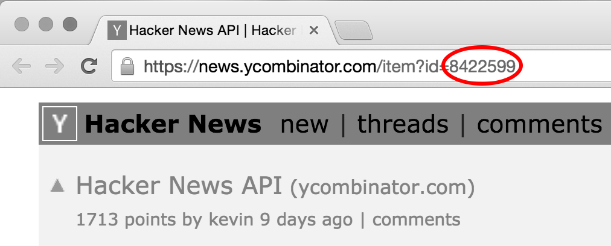

hnfp - Hacker News Front Page
================================

A tool to determine if an article is on the front page of HN, and for how long
it's been there.

##Table of Contents:
1. [Installation](#installation)
1. [Usage](#usage)
1. [Future Goals](#future-goals)
1. [Authors](#authors)
1. [License](#license)

##Installation

hnFrontPage is installable via [npm](https://www.npmjs.org/) and depends on [Node.js](http://nodejs.org/).
```
$ npm install -g hnfp
```

Uninstallation is just as simple.
```
$ npm uninstall -g hnfp
```

##Usage

Step 1. Submit your story to Hacker News via the [website](https://news.ycombinator.com/submit)

Step 2. Get your story's unique ID by clicking "discuss", and getting it from the url.


Step 3. Enter the following in the command line:

```
$ hnfp [your ID here] [polling frequency in minutes]
```

So, if you're trying to check the Hacker News API article shown above every 5 minutes, you would type:
```
$ hnfp 8422599 5
```
and you'd get the following outputs initially, then every 5 minutes thereafter:
```
----------------------------------------
Thu Oct 16 2014 19:21:12 GMT-0700 (PDT)
"YOUR TITLE HERE", by: YOU
Not on the front page yet! Good luck :)
----------------------------------------
```

```
------------------------------------------------------------
Thu Oct 16 2014 20:46:13 GMT-0700 (PDT)
"YOUR TITLE HERE", by: YOU
On the front page for 0 hours, 5 minutes, and 59 seconds.
------------------------------------------------------------
```

##Future Goals

1. Track upvotes
1. Track number of comments
1. Show top comments
1. Track changes in position on front page

##Authors
[Kia Fathi](http://github.com/kiafathi)

[Andrew Zey](http://github.com/andrewzey)

##License
Licensed under the MIT License.
